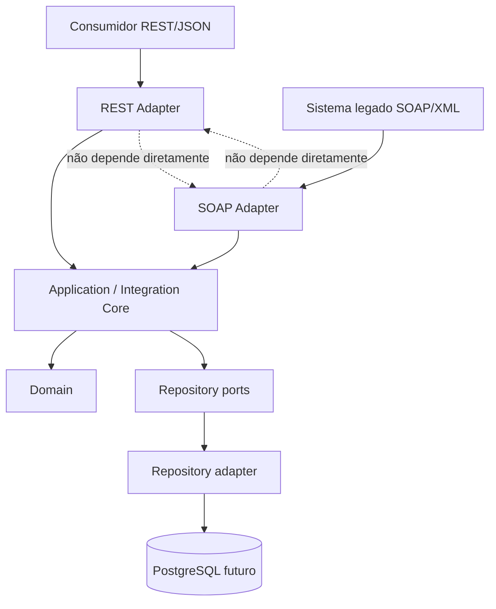

# Arquitetura — Enterprise Integration Hub

## Visão geral

O Enterprise Integration Hub será uma plataforma de interoperabilidade entre sistemas legados SOAP/XML e consumidores modernos REST/JSON. Esta é uma arquitetura-alvo para orientar as próximas fases: não há código de aplicação, endpoints, persistência, dependências ou infraestrutura implementados nesta etapa.

A arquitetura escolhida combina camadas de responsabilidade com Ports and Adapters (arquitetura hexagonal): adaptadores de entrada convertem protocolos externos para comandos internos; a camada de aplicação orquestra casos de uso; o domínio preserva as regras de negócio; e adaptadores de saída isolam persistência e futuras integrações externas.



REST e SOAP são fronteiras independentes. Não haverá conversão direta REST → SOAP nem SOAP → REST: ambos os fluxos passam por comandos, resultados e modelos internos independentes de transporte.

## Contract-first architecture

Os contratos existentes são as fontes de verdade nas bordas:

- [OpenAPI](../contracts/openapi/openapi.yaml) define a interface REST/JSON.
- [WSDL](../contracts/soap/service.wsdl) e seus XSDs, incluindo [Patient](../contracts/soap/xsd/patient.xsd) e [Appointment](../contracts/soap/xsd/appointment.xsd), definem a interface SOAP/XML.

Os contratos não definem o modelo interno nem as entidades do domínio. Eles orientam validadores e mapeadores específicos de cada adaptador. Alterações incompatíveis deverão ser publicadas em uma nova versão de contrato, com uma estratégia explícita de convivência.

## Application Architecture

### Estrutura proposta

Não é recomendável criar ainda a estrutura no repositório: ela deve nascer junto da primeira implementação aprovada.

```text
app/
├── main.py
├── core/
├── domain/
├── application/
├── adapters/
│   ├── rest/
│   ├── soap/
│   └── persistence/
└── schemas/
```

`main.py` será responsável pela composição da aplicação e pelo ciclo de vida. `adapters/rest` será responsável pela borda HTTP/JSON, incluindo rotas/controllers e mapeamentos. Não haverá uma camada `api/` separada.

### Responsabilidades e direção de dependências

| Camada | Responsabilidade | Pode depender de |
| --- | --- | --- |
| Domain | Entidades, invariantes e regras de negócio puras | Apenas código do próprio domínio e biblioteca padrão quando possível |
| Application / Integration Core | Orquestração dos casos de uso e aplicação das regras de negócio da camada de aplicação, comandos e portas | Domain e interfaces declaradas pela própria application |
| Adapters de entrada | Validar/interpretar protocolo, mapear entrada e saída, traduzir erros | Application, schemas e componentes técnicos de borda |
| Adapters de saída | Implementar portas para banco e serviços externos | Interfaces da application, biblioteca/SDK técnico e infraestrutura |
| Core | Configuração, composição de dependências, correlação e observabilidade | Componentes técnicos; não contém regra de negócio |

As dependências apontam para dentro. Em especial, `domain` não importa `application`, `adapters`, `schemas` ou `core`; `application` não importa FastAPI, Pydantic, SOAP, XML, HTTP, PostgreSQL nem um driver específico.

### Domain

O domínio conterá `Patient` e `Appointment` como entidades de negócio e, quando necessário, value objects para conceitos com invariantes próprias, como identificadores e horários. Ele expressará regras que devem valer independentemente de o pedido chegar em JSON, XML, fila ou linha de comando.

Para manter essa independência, as entidades receberão tipos primitivos ou tipos do próprio domínio, e retornarão resultados ou erros do domínio. Serialização, anotações de framework, modelos Pydantic, objetos de request/response HTTP, elementos XML e modelos de banco ficam fora dessa camada. O domínio também não executa SQL, não conhece tabelas e não emite respostas HTTP ou SOAP Faults.

### Application / Integration Core

O Integration Core é a camada de aplicação. Ela materializa os casos de uso e define a linguagem comum usada por REST e SOAP. Sua responsabilidade futura é:

- receber comandos internos, como `CreatePatient`, `GetPatient`, `CreateAppointment` e `GetAppointment`;
- validar pré-condições de aplicação e invocar as regras do domínio;
- orquestrar entidades, repositories e portas para serviços externos;
- controlar limites transacionais quando a persistência for introduzida;
- devolver resultados internos, nunca `Response`, JSON, XML ou objetos de framework.

Interfaces (portas) a serem declaradas pela camada de aplicação, sem implementação nesta fase:

```text
PatientRepository
  - get_by_id(patient_id) -> Patient | None
  - get_by_document(document) -> Patient | None
  - save(patient) -> Patient

AppointmentRepository
  - get_by_id(appointment_id) -> Appointment | None
  - has_conflict(patient_id, scheduled_at, ...) -> bool
  - save(appointment) -> Appointment
```

As assinaturas finais deverão ser refinadas pelos casos de uso e invariantes aprovados. Os services da aplicação recebem essas interfaces por injeção de dependência; a futura implementação PostgreSQL será apenas um adapter de saída de `persistence`.

### REST Adapter

O REST Adapter é somente uma porta de entrada. Ele deverá receber HTTP, obter ou criar o Correlation ID, validar a requisição contra o contrato e schema de borda, converter JSON para um comando interno, chamar o service da aplicação e converter o resultado para JSON/HTTP.

Ele também fará o mapeamento de erros de aplicação para status e payloads HTTP. Não acessará repositories ou PostgreSQL diretamente, não conterá regra de negócio e não executará transformação SOAP.

### SOAP Adapter

O SOAP Adapter é uma porta de entrada independente. Ele deverá receber envelopes XML, obter ou criar o Correlation ID do header SOAP, validar mensagens conforme WSDL/XSD, convertê-las para o mesmo comando interno usado pelo REST Adapter e chamar o service da aplicação.

O resultado interno será transformado para a resposta XML definida pelo contrato. Falhas conhecidas serão convertidas para SOAP Faults compatíveis. O adapter não acessará repositories ou PostgreSQL, não conterá regras de negócio e não conhecerá HTTP/REST.

### Repository e persistência

`PatientRepository` e `AppointmentRepository` são portas de saída da aplicação. Elas descrevem as operações necessárias ao negócio, em termos de entidades e value objects, e não em termos de tabelas, SQL ou driver.

O futuro adapter de persistência implementará essas portas e será o único lugar que conhecerá PostgreSQL, SQL, ORM ou mapeamentos de banco. A composição em `core` fornecerá essa implementação aos services da aplicação. Nesta fase não há banco, schema físico, migration ou código de persistência.

### Transformações

Os mapeadores vivem nas bordas, próximos ao protocolo que entendem:

| Transformação | Responsável futuro |
| --- | --- |
| JSON → comando/modelo interno | REST Adapter, com DTO/schema REST em `schemas` |
| XML → comando/modelo interno | SOAP Adapter, com DTO/schema SOAP em `schemas` |
| resultado/modelo interno → JSON | REST Adapter |
| resultado/modelo interno → XML | SOAP Adapter |

Os modelos internos não precisam espelhar um payload JSON ou XML. A camada de aplicação decide o resultado do caso de uso; cada adapter faz a projeção que seu contrato exige. Assim, alterações de XML não exigem mudanças no REST, e alterações de JSON não exigem mudanças no SOAP.

### Tratamento de erros

Erros esperados serão definidos com semântica de negócio, sem metadados de transporte. A hierarquia sugerida é:

```text
ApplicationError
├── ValidationError
│   ├── InvalidPatient
│   └── InvalidAppointment
├── NotFoundError
│   ├── PatientNotFound
│   └── AppointmentNotFound
└── ConflictError
    ├── DuplicatePatient
    └── AppointmentConflict
```

Erros estritamente ligados a invariantes podem originar no domínio e ser traduzidos para um erro de aplicação pelo caso de uso. Falhas inesperadas de infraestrutura não devem expor detalhes internos e serão registradas com o Correlation ID.

O REST Adapter converte esses erros para HTTP — por exemplo, `PatientNotFound` em 404, conflitos em 409 e dados inválidos em 422. O SOAP Adapter os converte para SOAP Faults com códigos previstos pelo contrato, como `PATIENT_NOT_FOUND`, `DUPLICATE_PATIENT`, `INVALID_PATIENT`, `APPOINTMENT_NOT_FOUND`, `INVALID_APPOINTMENT` e `APPOINTMENT_CONFLICT`. O mapeamento é responsabilidade exclusiva dos adapters.

### Correlation ID

O Correlation ID será tratado como contexto de execução técnico, não como regra de domínio. Na entrada REST, o adapter/middleware aceitará `X-Correlation-ID` quando válido ou criará um identificador novo. Na entrada SOAP, o SOAP Adapter extrairá o identificador do header SOAP acordado ou criará um novo quando ele estiver ausente.

Ambos propagam o valor como um `correlation_id` interno associado ao comando ou a um contexto de requisição da camada de aplicação. Services, adapters de saída e logs estruturados o usarão para rastreabilidade. As respostas poderão devolvê-lo no header correspondente. Nenhuma entidade de domínio deverá depender dele.

### Estratégia de testes

| Tipo | Objetivo | Escopo principal |
| --- | --- | --- |
| `tests/unit/` | Verificar regras de domínio, casos de uso e mapeadores isoladamente | Entidades, services da application, erros e conversores |
| `tests/integration/` | Verificar colaboração entre camadas e adapters com implementações controladas | Adapter → application → repository adapter; comportamento de falhas e correlação |
| `tests/contract/` | Garantir aderência das bordas aos contratos versionados | OpenAPI para REST; WSDL e XSD para SOAP; exemplos de `contracts/examples/` quando aplicáveis |

Testes de contrato devem validar requisições e respostas REST contra OpenAPI e mensagens SOAP contra WSDL/XSD, incluindo os formatos de erro previstos. Eles não substituem testes unitários de regra de negócio nem testes de integração de persistência quando ela existir.

## Fluxos futuros

### Fluxo REST

1. O consumidor envia uma requisição HTTP/JSON ao REST Adapter.
2. O adapter obtém ou cria o `X-Correlation-ID`, valida o contrato/schema e mapeia JSON para um comando interno.
3. O Integration Core executa o caso de uso, aplica regras do domínio e usa as portas de repository necessárias.
4. O adapter de persistência, quando existir, implementa a porta e interage com PostgreSQL.
5. O REST Adapter converte o resultado para JSON/HTTP ou converte um erro de aplicação para a resposta HTTP apropriada.

### Fluxo SOAP

1. O sistema legado envia envelope SOAP/XML ao SOAP Adapter.
2. O adapter obtém ou cria o Correlation ID, valida WSDL/XSD e mapeia XML para o mesmo comando interno.
3. O Integration Core executa o mesmo caso de uso, regras de domínio e portas de repository do fluxo REST.
4. O adapter de persistência, quando existir, implementa a porta e interage com PostgreSQL.
5. O SOAP Adapter converte o resultado para XML ou converte um erro de aplicação para uma SOAP Fault compatível.

## Decisões desta fase

| Decisão | Justificativa |
| --- | --- |
| Application como núcleo de integração | Centraliza orquestração e evita que protocolos contenham casos de uso. |
| Domain puro | Mantém regras de Patient e Appointment portáveis e testáveis sem framework. |
| Ports para repositories | Permite introduzir PostgreSQL sem acoplar a aplicação a SQL ou ORM. |
| Mapeamento por adapter | Impede dependência direta entre REST e SOAP. |
| Correlation ID no contexto técnico | Garante rastreabilidade sem poluir entidades ou regras de negócio. |

## Fora do escopo desta etapa

Esta documentação não introduz implementação de endpoints REST ou SOAP, dependências, ambiente virtual, banco de dados, PostgreSQL, migrations, Docker, SQL, adapters executáveis ou alterações nos contratos. Nenhum commit ou push faz parte desta fase.
