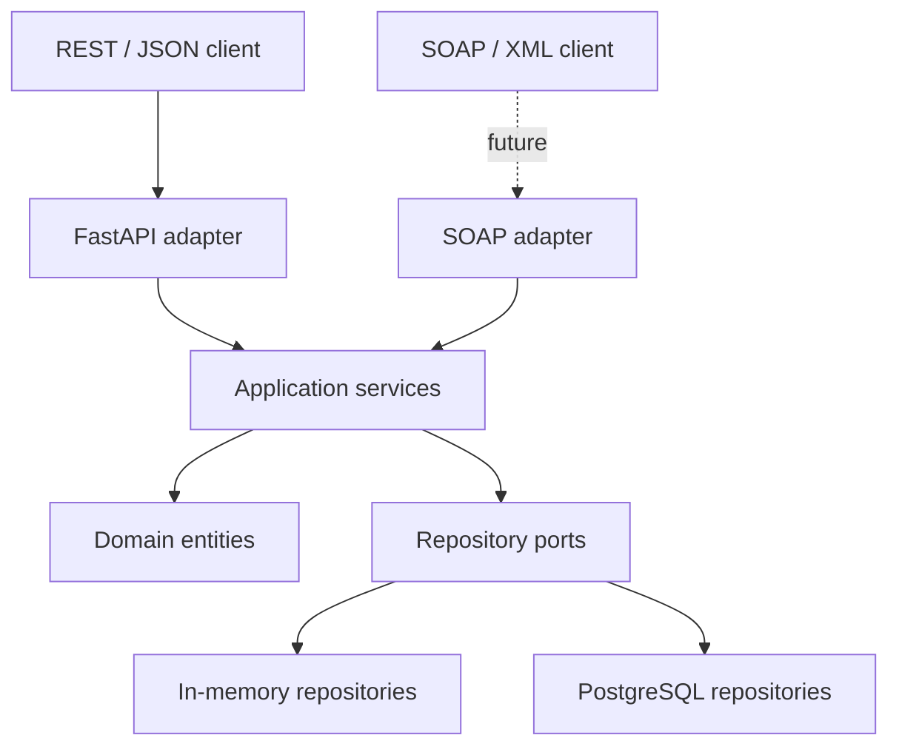

# Architecture — Enterprise Integration Hub

## Overview

Enterprise Integration Hub is a healthcare interoperability portfolio built around ports and adapters. The current codebase includes an executable FastAPI REST boundary, transport-independent application services, domain entities, in-memory repositories, PostgreSQL repositories, SQLAlchemy mappings, an Alembic migration and automated tests.

OpenAPI, WSDL and XSD artifacts define the external contracts. The REST adapter is implemented. The SOAP adapter remains a planned boundary and is not represented as an executable service.


```mermaid
flowchart TB
    REST["REST / JSON client"] --> RA["FastAPI adapter"]
    SOAP["SOAP / XML client"] -. future .-> SA["SOAP adapter"]
    RA --> APP["Application services"]
    SA --> APP
    APP --> DOMAIN["Domain entities"]
    APP --> PORTS["Repository ports"]
    PORTS --> MEM["In-memory repositories"]
    PORTS --> PG["PostgreSQL repositories"]
```

REST and SOAP are independent input boundaries. They do not convert directly into each other. Each adapter maps its transport-specific request into internal commands, invokes the same application services and maps results or errors back to its own protocol.

## Implementation map

```text
app/
├── main.py                         # composition root and Correlation ID middleware
├── core/                           # technical infrastructure errors
├── domain/                         # Patient and Appointment entities and rules
├── application/
│   ├── commands/                   # transport-independent input models
│   ├── results/                    # transport-independent output models
│   ├── services/                   # use-case orchestration
│   └── ports/                      # repository interfaces
├── adapters/
│   ├── rest/                       # implemented FastAPI boundary
│   ├── persistence/                # in-memory and PostgreSQL adapters
│   └── soap/                       # placeholder for the future runtime adapter
└── schemas/                        # REST request and response schemas
```

## Dependency direction

| Layer | Responsibility | Dependencies |
|---|---|---|
| Domain | Entities, invariants and business rules | Domain code and standard library |
| Application | Commands, results, use cases and ports | Domain and application-owned interfaces |
| REST adapter | HTTP/JSON validation and response/error mapping | Application, schemas and FastAPI |
| Persistence adapters | Repository implementations and mappings | Application ports, SQLAlchemy and PostgreSQL |
| Composition root | Select implementations and assemble services | Adapters and application services |

Dependencies point inward. Domain entities do not import FastAPI, Pydantic, SQLAlchemy, PostgreSQL, XML or SOAP libraries. Application services receive repository ports and remain transport-independent.

## Composition and persistence selection

`app/main.py` is the composition root.

- Explicit repositories can be injected into `create_app` for controlled tests.
- When `DATABASE_URL` is present, the application creates PostgreSQL repository adapters.
- Without `DATABASE_URL`, the application uses in-memory repositories.

The PostgreSQL adapter uses SQLAlchemy 2 and psycopg. The Alembic migration creates `patients` and `appointments`, including UUID primary keys, CPF uniqueness, the patient foreign key, an appointment status constraint and an index on `patient_id`.

## REST boundary

The FastAPI adapter currently implements health, patient and appointment endpoints. REST schemas validate input and serialize results. Exception handlers translate application failures into stable HTTP status codes and error payloads.

The adapter does not contain domain rules and does not access database tables directly. It obtains application services from the composed application state.

## SOAP boundary

The WSDL, XSD files and XML examples describe the intended SOAP operations and faults. The runtime adapter is not yet implemented.

When added, it must:

1. Validate incoming XML against the versioned contracts.
2. Map SOAP messages to the existing application commands.
3. Invoke the same application services used by REST.
4. Map application results to SOAP responses.
5. Translate known application failures to contract-compatible SOAP Faults.

It must not call REST endpoints internally or duplicate domain rules.

## Repository ports

Application-owned ports isolate use cases from persistence technology.

```text
PatientRepository
  - get_by_id(patient_id)
  - get_by_cpf(cpf)
  - save(patient)
  - list_all()

AppointmentRepository
  - get_by_id(appointment_id)
  - has_conflict(patient_id, appointment_date)
  - save(appointment)
```

In-memory and PostgreSQL implementations satisfy these ports. Explicit mapping functions translate between domain entities and SQLAlchemy models.

## Error handling

Expected failures use application-level semantics that do not contain HTTP or SOAP objects.

```text
ApplicationError
├── InvalidPatientData
├── InvalidAppointmentData
├── PatientNotFound
├── AppointmentNotFound
├── DuplicatePatient
└── AppointmentConflict
```

The REST adapter maps these errors to HTTP responses. The future SOAP adapter will map the same semantics to the faults defined in the WSDL/XSD contract. Unexpected persistence failures are translated to safe infrastructure errors without exposing database details.

## Correlation ID

FastAPI middleware accepts `X-Correlation-ID` from the caller or generates a UUID when it is absent. The value is returned in the response and placed in request state.

The next observability increment should validate the accepted header format and propagate the identifier through structured logs and future outbound integrations. A SOAP implementation should apply the same concept through an agreed SOAP header.

## Testing strategy

| Test area | Current evidence |
|---|---|
| Domain | Entity invariants and valid state transitions |
| Application | Use cases with repository fakes and deterministic IDs/timestamps |
| REST | Endpoints, validation, error responses, contracts and Correlation ID |
| Persistence | Mappings, constraints, repository behavior and safe infrastructure failures |

The persistence tests currently exercise mappings and repository behavior with controlled test doubles. A future Docker-based suite should run the Alembic migration and repository operations against an ephemeral PostgreSQL instance.

## Next architectural increments

1. Implement the SOAP adapter against the existing WSDL and XSD artifacts.
2. Add structured logging and Correlation ID propagation.
3. Add authentication and authorization at the adapters.
4. Add Docker and a real PostgreSQL integration-test environment.
5. Add CI for unit, REST, contract and database integration tests.
6. Publish a deployment runbook and stable release.

## Scope

Hospital Vida Integrada is fictional. All examples use synthetic data. The project contains no production healthcare records, employer code or credentials.
